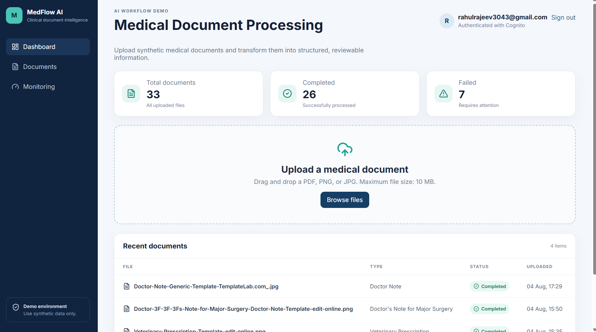

# 🏥 MedFlow AI

An AI-powered **serverless medical document processing platform** built on AWS.

MedFlow AI enables healthcare documents to be securely uploaded, processed asynchronously using OCR and Generative AI, and transformed into structured medical information. The application demonstrates a modern cloud-native backend architecture using AWS serverless services, event-driven processing, and production-style monitoring.

---

# 🌐 Live Deployment

The application is fully deployed on AWS using a serverless architecture.

- **Frontend:** Amazon S3 + Amazon CloudFront
- **Backend:** AWS Lambda (Container) + Amazon API Gateway

**Live Application**

https://d1d8yct7oy0z3l.cloudfront.net

> **Demo Account**
>
> Authentication is required. Please contact me if you would like demo credentials.
# 🚀 Features

- Secure user authentication with **Amazon Cognito**
- Upload **PDF, PNG, and JPEG** medical documents
- AI-powered document analysis using **Amazon Bedrock**
- OCR text extraction using **Tesseract OCR**
- Real-time document processing status updates
- Smart frontend polling for active document processing
- Asynchronous processing with **Amazon SQS**
- Dead Letter Queue (DLQ) for failed message handling
- Container images managed using **Docker and Amazon ECR**
- Containerized **FastAPI** backend deployed on **AWS Lambda**
- Structured document metadata stored in **Amazon RDS PostgreSQL**
- Structured application logging with **Amazon CloudWatch**
- Distributed tracing using **AWS X-Ray** and **CloudWatch Application Signals**
- End-to-end request traceability using **document_id**
- Fully serverless, event-driven cloud architecture

---
# 📸 Screenshots

## 🏠 Homepage


---

## 🔐 Login


---

## 📊 Dashboard



---

## 📤 Upload & Processing


---

## 🤖 AI Document Analysis


# 🏗️ Architecture

```text
                          React + TypeScript
                                  │
                             CloudFront
                                  │
                          Amazon Cognito
                                  │
                            API Gateway
                                  │
                 ┌──────── FastAPI Lambda ────────┐
                 │      (Container Image)         │
                 │                                │
                 ▼                                ▼
            Amazon S3                 Amazon RDS PostgreSQL
                 │                         (Inside VPC)
                 │
                 ▼
            Amazon SQS
                 │
                 ▼
      Worker Lambda (Container)
            (Inside VPC)
                 │
                 ▼
          Tesseract OCR
                 │
                 ▼
          Amazon Bedrock
                 │
                 ▼
        Update PostgreSQL
                 │
                 ▼
       Processing Completed

          Failed Processing
                 │
                 ▼
      Amazon SQS Dead Letter Queue
```

---

# ⚙️ Technology Stack

## Frontend

* React
* TypeScript
* Vite

## Backend

* Python
* FastAPI
* SQLAlchemy
* Alembic
* Boto3
* Pydantic
* PostgreSQL
* Tesseract OCR
* Docker

## AWS Services

* Amazon CloudFront
* Amazon Cognito
* Amazon API Gateway
* AWS Lambda
* Amazon ECR
* Amazon S3
* Amazon SQS
* Amazon SQS Dead Letter Queue (DLQ)
* Amazon Bedrock
* Amazon RDS PostgreSQL
* Amazon VPC
* AWS IAM
* Amazon CloudWatch
* AWS X-Ray / CloudWatch Application Signals

---

# 📄 Document Processing Flow

```text
Upload Document
        │
        ▼
React Frontend
        │
        ▼
CloudFront
        │
        ▼
API Gateway
        │
        ▼
FastAPI Lambda
        │
        ├── Upload document to Amazon S3
        ├── Save metadata to Amazon RDS
        └── Publish Amazon SQS message
                    │
                    ▼
           Worker Lambda
                    │
        Download file from Amazon S3
                    │
                    ▼
            Tesseract OCR
                    │
                    ▼
          Amazon Bedrock
                    │
                    ▼
        Update PostgreSQL
                    │
                    ▼
        Processing Completed

       Processing Failure
                    │
                    ▼
     Amazon SQS Dead Letter Queue
```

---

# 📊 Monitoring & Observability

MedFlow AI includes production-style observability for debugging and monitoring distributed serverless applications.

* Structured CloudWatch application logs
* End-to-end request tracing using **document_id**
* AWS X-Ray distributed tracing
* CloudWatch Application Signals
* Lambda execution metrics
* Processing duration metrics
* Bedrock token usage logging
* OCR statistics
* API upload logs
* Worker processing logs
* Dead Letter Queue monitoring

---

# 🔒 Security

* Amazon Cognito authentication
* IAM least-privilege roles
* HTTPS through CloudFront and API Gateway
* PostgreSQL deployed inside a private Amazon VPC
* Secure document storage in Amazon S3
* Containerized Lambda execution using Amazon ECR

---

# 🌐 API Endpoints

| Method | Endpoint                          | Description               |
| ------ | --------------------------------- | ------------------------- |
| POST   | `/api/v1/documents`               | Upload a medical document |
| GET    | `/api/v1/documents`               | List uploaded documents   |
| GET    | `/api/v1/documents/{document_id}` | Retrieve document details |

---

# 🚀 Deployment

The application is deployed using a fully serverless AWS architecture.

* Frontend hosted on **Amazon S3** and delivered globally through **Amazon CloudFront**
* Backend deployed as **containerized AWS Lambda functions**
* Lambda container images stored in **Amazon ECR**
* REST APIs exposed through **Amazon API Gateway**
* PostgreSQL hosted on **Amazon RDS**
* Worker processing triggered asynchronously through **Amazon SQS**

---

# 💻 Local Development

## Prerequisites

- Python 3.12
- Node.js 20+
- Docker Desktop
- PostgreSQL (Docker)
- AWS CLI

## Start PostgreSQL

```bash
docker compose up -d
```

## Backend

```bash
cd backend

python -m venv .venv

# Windows
.venv\Scripts\activate

copy .env.example .env

pip install -r requirements.txt

uvicorn app.main:app --reload
```

Backend URLs

```text
API
http://localhost:8000

Swagger
http://localhost:8000/docs

Health
http://localhost:8000/health
```

## Frontend

```bash
cd frontend

npm install

npm run dev
```

Frontend

```text
http://localhost:5173
```

---

# ⭐ Project Highlights

* Serverless event-driven architecture
* Containerized AWS Lambda deployment using Amazon ECR
* AI-powered medical document understanding
* OCR using Tesseract OCR
* Asynchronous processing with Amazon SQS
* Dead Letter Queue (DLQ) support
* Secure authentication with Amazon Cognito
* Private database inside Amazon VPC
* Structured logging and distributed tracing
* Cloud-native deployment on AWS

---

# 📚 Documentation

Additional documentation is available in the **docs/** directory.

* Architecture Overview
* AWS Deployment
* Monitoring & Observability
* API Reference
* System Design

---

# 🚧 Future Improvements

* Support additional document formats
* Email notifications after processing
* Document search using vector embeddings
* Multi-user organization support
* Automated infrastructure provisioning using Terraform/CDK

---

# 👨‍💻 Author

Rahul Mudatholy

LinkedIn: https://linkedin.com/in/rahulrajeev35

GitHub: https://github.com/rahulrajeev5

> **Note:** This project is intended for demonstration and learning purposes only. All documents used are synthetic and contain no real patient information.
